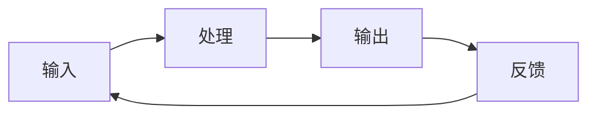

## 引言

在这个知识爆炸的时代，如何有效地学习成为了每个人都需要面对的问题。古人云"格物致知"，这四个字蕴含着深刻的学习智慧。

## 什么是格物致知？

### 古典解释

"格物致知"出自《礼记·大学》：

> "古之欲明明德于天下者，先治其国；欲治其国者，先齐其家；欲齐其家者，先修其身；欲修其身者，先正其心；欲正其心者，先诚其意；欲诚其意者，先致其知；致知在格物。"

- **格物**：接触事物，深入了解事物的本质
- **致知**：获得知识，达到真正的理解

### 现代理解

在现代学习语境下，我理解的"格物致知"包含三个层次：

1. **观察现象**（格物）- 深入接触和观察
2. **理解本质**（致知）- 透过现象看本质
3. **应用实践**（知行合一）- 将知识转化为能力

## 我的学习方法论

### 1. 主动探索 vs 被动接受

传统教育往往是被动接受知识，但真正的学习应该是主动探索：

```
被动学习：老师讲 → 学生听 → 考试背
主动学习：问题驱动 → 主动探索 → 实践验证
```

**实践方法：**
- 带着问题去学习
- 主动寻找学习资源
- 通过实践验证理论

### 2. 深度学习 vs 浅层学习

现代信息过载容易导致浅层学习，但真正的成长需要深度学习：

| 浅层学习 | 深度学习 |
|---------|---------|
| 记忆事实 | 理解原理 |
| 孤立知识点 | 构建知识网络 |
| 短期记忆 | 长期理解 |

**实践方法：**
- 追问"为什么"和"如何"
- 建立知识之间的联系
- 用自己的话重新表达

### 3. 输入与输出的平衡

学习不仅是输入信息，更重要的是输出和创造：



**输入方式：**
- 阅读书籍和文章
- 观看视频和讲座
- 参与讨论和交流

**输出方式：**
- 写作和总结
- 教授他人
- 实际应用

## 具体实践策略

### 1. 费曼学习法

以物理学家理查德·费曼命名的学习方法：

1. **选择概念**：选择要学习的概念
2. **简单解释**：用简单的语言解释给别人听
3. **发现问题**：找出解释中的问题和不足
4. **重新学习**：回到原材料，重新学习

### 2. 间隔重复

基于遗忘曲线的学习策略：

- **第1天**：学习新知识
- **第2天**：第一次复习
- **第7天**：第二次复习
- **第21天**：第三次复习
- **第60天**：第四次复习

### 3. 刻意练习

不是简单的重复，而是有目的的练习：

- **明确目标**：知道要达到什么水平
- **专注练习**：集中注意力在薄弱环节
- **及时反馈**：获得准确的反馈信息
- **持续改进**：根据反馈调整练习方法

## 数字时代的学习挑战

### 信息过载

现代人面临的最大挑战是信息过载：

**问题：**
- 信息量巨大，难以筛选
- 碎片化学习，缺乏系统性
- 注意力分散，深度不够

**解决方案：**
- 建立信息筛选标准
- 制定学习计划和目标
- 创造专注的学习环境

### 即时满足

数字时代培养了我们对即时满足的需求：

**问题：**
- 缺乏耐心进行深度学习
- 追求快速获得结果
- 容易放弃困难的学习任务

**解决方案：**
- 设定长期学习目标
- 培养延迟满足的能力
- 庆祝小的进步和成就

## 我的学习工具箱

### 知识管理工具

- **笔记软件**：Obsidian / Notion
- **阅读工具**：Kindle / 微信读书
- **思维导图**：MindMeister / XMind

### 学习方法

- **番茄工作法**：25分钟专注学习
- **康奈尔笔记法**：结构化记录笔记
- **SQ3R阅读法**：Survey, Question, Read, Recite, Review

## 结语

学习是一个终身的过程，"格物致知"不仅是一种学习方法，更是一种生活态度。在这个快速变化的时代，保持学习的热情和方法的科学性，才能在知识的海洋中找到属于自己的航向。

> "学而时习之，不亦说乎？" —— 《论语》

愿我们都能在学习的道路上，既有古人的智慧，又有现代的方法，既能格物，又能致知。
